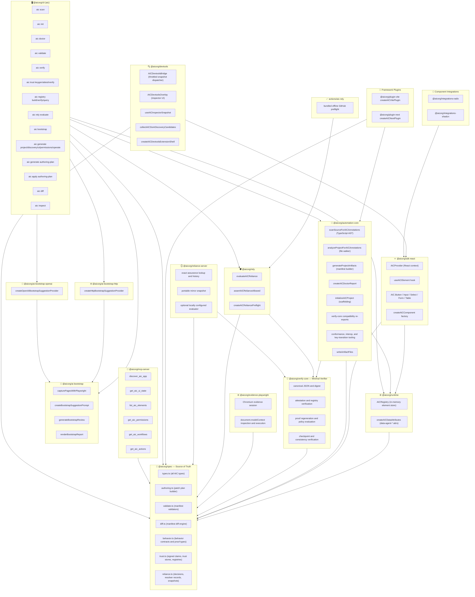
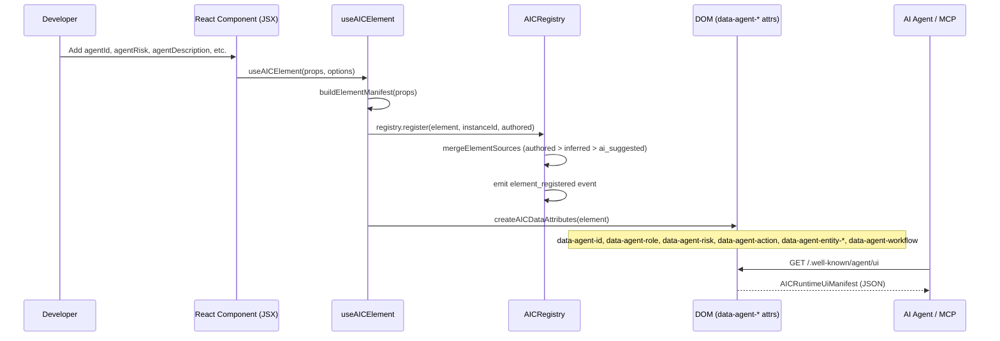
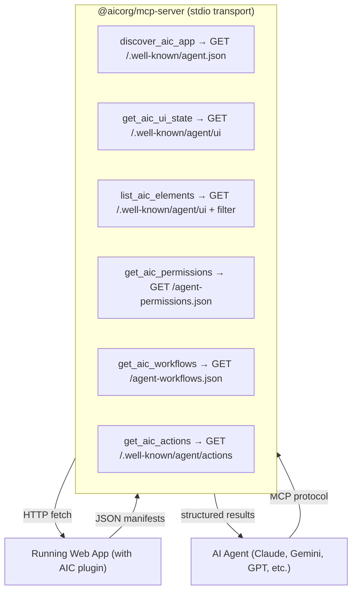
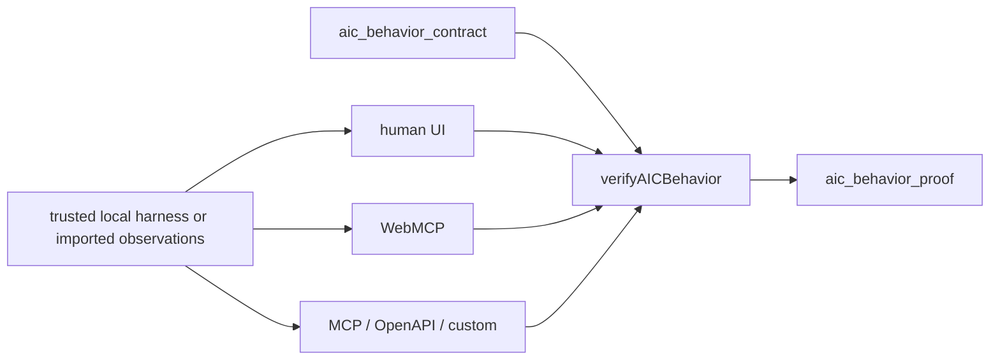
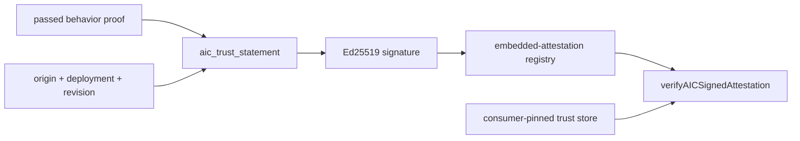
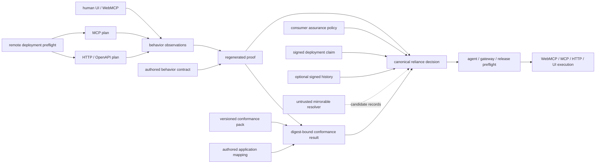
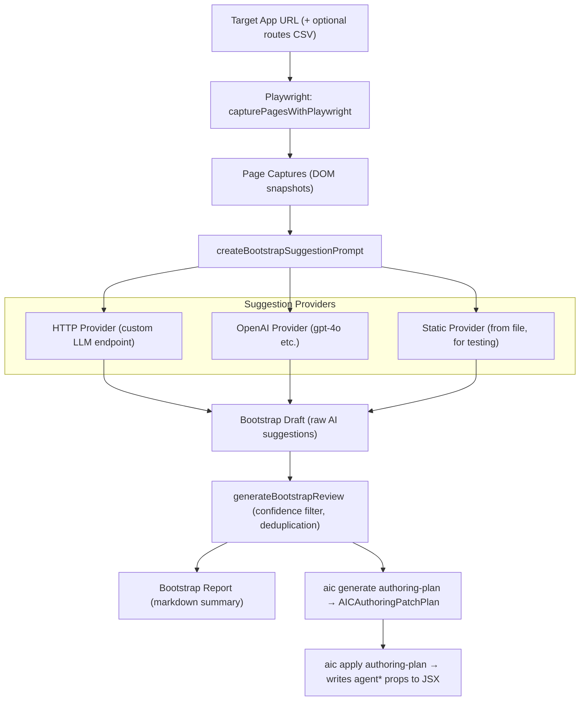
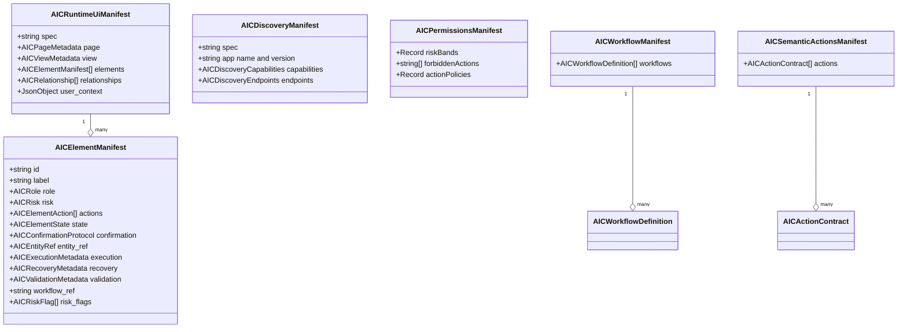
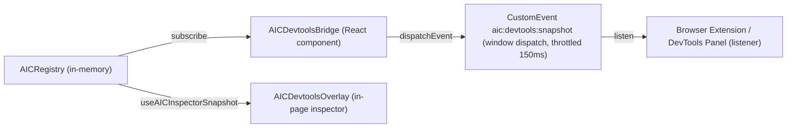

# AIC — Agent Interaction Control: Full Architecture

## System Overview

AIC is a **contract-first framework** that makes web apps reliably operable by AI agents. It does this by:

1. **Authoring** — developers annotate UI elements with stable `agent*` props
2. **Generating** — build-time tools extract those annotations into standardized JSON manifests
3. **Serving** — framework plugins expose manifests on `.well-known/` HTTP endpoints at runtime
4. **Consuming** — the MCP server exposes those manifests as tools that any AI agent can call
5. **Proving** — protocol-neutral contracts and executed observations verify behavior across UI, WebMCP, MCP, and API surfaces
6. **Attesting** — signed statements bind a passed proof to an issuer, origin, deployment, and source revision for independent verification
7. **Relying** — an agent, gateway, or release system applies its own fail-closed policy to the exact target immediately before execution

---

## Package Dependency Graph



---

## Runtime Data Flow (App in Browser)



---

## Build-Time Artifact Generation Flow

```mermaid
flowchart LR
    SRC["Source Files (.tsx / .jsx)"]

    subgraph AUTOMATION_CORE["@aicorg/automation-core"]
        TS["TypeScript AST Parser"]
        SCANNER["scanSourceForAICAnnotations → AICSourceScanMatch[]"]
        GENERATOR["generateProjectArtifacts"]
    end

    CONFIG["aic.project.json"]

    subgraph ARTIFACTS["Generated .well-known Artifacts"]
        A1["/.well-known/agent.json (discovery)"]
        A2["/.well-known/agent/ui (runtime UI manifest)"]
        A3["/.well-known/agent/actions (semantic actions)"]
        A4["/agent-permissions.json"]
        A5["/agent-workflows.json"]
        A6["/operate.txt (agent instructions)"]
        A7["/report.json (onboarding report)"]
    end

    SRC --> TS --> SCANNER --> GENERATOR
    CONFIG --> GENERATOR
    GENERATOR --> ARTIFACTS
```



---

## Well-Known Endpoint Map

| Endpoint | Manifest Type | Description |
|---|---|---|
| `/.well-known/agent.json` | `AICDiscoveryManifest` | App name, version, supported capabilities, endpoint URLs |
| `/.well-known/agent/ui` | `AICRuntimeUiManifest` | All rendered elements with full metadata |
| `/.well-known/agent/actions` | `AICSemanticActionsManifest` | Pre/post-conditions, completion signals, side-effects |
| `/agent-permissions.json` | `AICPermissionsManifest` | Risk-band policies, forbidden actions, reauth requirements |
| `/agent-workflows.json` | `AICWorkflowManifest` | Named multi-step workflows with entry points & rollback |
| `/operate.txt` | Plain text | Human-readable AIC summary for agent system prompts |

---

## MCP Server — AI Agent-Facing Tools



## WebMCP — Browser-Native Execution

`@aicorg/webmcp` is a separate, feature-detected compatibility adapter. WebMCP supplies browser-native tool discovery and invocation. AIC consumes native protocol capabilities first and currently adds fail-closed readiness gates while the API remains experimental.

The adapter does not convert runtime elements or generated actions automatically. Only an explicit task-level binding backed by an authored `execution_ready` action contract can register. The human UI and tool path must call the same application/domain function.

The read-only MCP server and AIC manifests remain available for headless discovery, unsupported browsers, and consumers that need the richer AIC contract surface.

## Behavior Assurance — Protocol-Neutral Proof

Behavior Assurance sits below individual protocols:



The contract maps protocol-specific entrypoints to one stable domain `operation_id`. The verifier checks expected status, confirmation, error, outcome, required and forbidden behavior, and canonical parity across required surfaces. Proofs include evidence classification and SHA-256 digests. Signing remains a separate layer so proof semantics do not depend on one issuer or registry.

See [Behavior Assurance](./behavior-assurance.md).

## AIC Verified — Portable Trust Claims



The browser evidence package executes real rendered human controls and native WebMCP tools. The trust engine binds the resulting passed proof to deployment claims and signs canonical JSON with Ed25519. Registries remain untrusted discovery surfaces; verification uses consumer-pinned issuer keys and re-derives every convenience field.

The GitHub workflow adds a second provenance layer by using GitHub OIDC/Sigstore artifact attestation for the complete evidence archive on trusted runs. Neither signature layer alone proves that a production origin is currently reachable.

See [AIC Verified Trust Layer](./trust-layer.md).

## Open Ecosystem Conformance

The ecosystem layer keeps protocol execution, behavior proof, conformance, and consumer reliance separate:



`@aicorg/evidence-core` owns strict plans, projections, artifacts, receipts, and bundle verification. `@aicorg/evidence-http` and `@aicorg/evidence-mcp` adapt their native protocols. `@aicorg/runner-remote` adds exact production identity, public-network pinning, bounded execution, and operator capabilities; it never executes submitted code.

`@aicorg/conformance-packs` supplies versioned operation-class obligations. The application binding is explicit and digest-bound. `@aicorg/verify-core` contains the minimal trust, proof-regeneration, assurance-policy, and transparency verifier used by reliance gates, without loading the scanner/compiler toolchain. `@aicorg/automation-core` re-exports those primitives for compatibility and adds conformance, portable compatibility suites, scheduled dual-signed key transitions, scanning, and authoring.

The deployment application's source revision and the runner software revision are distinct bindings. They are not required to match.

See [Protocol Evidence and Remote Observation](./evidence-adapters.md), [Conformance Packs](./conformance-packs.md), [Assurance Policy](./assurance-policy.md), and [Transparency and Key Rotation](./transparency-and-key-rotation.md).

## Trust Fabric — Consumer-Owned Preflight

`@aicorg/rely` is the canonical relying-party boundary. It receives caller-supplied artifacts only, regenerates the proof through the assurance-policy evaluator, verifies the signed claim against a separately supplied trust store, checks the exact origin, operation, deployment, revision, freshness, revocation state, and any policy-required signed transparency history, then returns an `aic_reliance_decision` with `allow`, `confirm`, `deny`, or `indeterminate`.

The decision is intentionally protocol-neutral. Thin adapters place the same guard before a WebMCP tool, MCP `tools/call`, HTTP mutation, browser action, or release promotion. They do not replace protocol-native authorization, confirmation, or invocation.

`createAICReliancePreflight` canonical-snapshots caller inputs, evaluates against a trusted current clock, re-evaluates after a clock advance, and locally reproduces the entire decision before returning. `assertAICRelianceAllowed` snapshots the complete consumer-owned input before touching an untrusted raw decision, canonical-clones that decision without evaluating accessors, re-evaluates at the claimed time, and returns the detached result only after a full canonical match. Trusted time and optional residual validity are checked after reproduction. Fabricated or stateful results, forged deadlines, missing, extra, or substituted artifacts, a different request audience, future or over-age decisions, and decisions at their exclusive `valid_until` fail. Every portable `allow` is capped at 60 seconds and shortened to the earliest applicable evidence, attestation-expiry, or transparency-checkpoint boundary.

The bundled `actions/aic-rely` JavaScript action applies the same verifier to bounded, regular JSON files in a GitHub runner without downloading a verifier at runtime. It pins the consumer policy and trust-store file digests plus explicit issuer, key, runner, origin, environment, deployment, operation, and revision identities. It succeeds only for a canonical `allow` produced at the runner's current time with at least 30 seconds of residual validity by default, and exposes the exclusive deadline separately so callers do not mistake a persisted boolean for authorization.

`@aicorg/reliance-server` is a read-only Fetch API reference service. It provides exact lookups, history, and exportable snapshots for independent mirrors. Those records are `unverified_discovery`; the service does not fetch artifact references or execute submitted code. Its optional `POST /v1/rely` endpoint uses an operator-configured local evaluator and rate limiter, but clients can always reproduce the decision locally. Resolver availability, DNS, and operator identity never become implicit trust anchors.

The package and action surfaces above are implemented in this repository. They are not yet evidence of npm publication, a public hosted resolver, external consumers, operator independence, or certification. See [AIC Trust Fabric](./trust-fabric.md) and [ADR 0005](./adr/0005-trust-fabric-reliance-network.md).

---

## Bootstrap Pipeline (AI-Assisted Annotation)



---

## CLI Command Reference

| Command | Purpose |
|---|---|
| `aic init [root]` | Scaffold `aic.project.json`, `AGENTS.md`, `GEMINI.md`, `CLAUDE.md`, `.cursor/rules/aic.mdc` |
| `aic scan <path>` | AST-scan for `agent*` props → JSON report of matches & diagnostics |
| `aic scan <path> --webmcp` | Detect governed, direct, declarative, and obsolete WebMCP usage |
| `aic doctor [root]` | Audit onboarding files, config, source annotations, and workflows |
| `aic doctor [root] --webmcp` | Add WebMCP compatibility and source-readiness findings to doctor output |
| `aic validate <kind> <file>` | Validate a manifest or behavior contract |
| `aic verify <behavior-contract> --harness <module>` | Execute observations, verify scenarios and parity, and emit a behavior proof |
| `aic trust keygen` | Generate an Ed25519 issuer key and pinned trust store |
| `aic trust attest` | Bind and sign a passed proof for an exact origin, deployment, and revision |
| `aic trust verify` | Verify signature, issuer policy, expectations, contract, and proof bindings |
| `aic registry build/verify/query` | Publish and consume independently verifiable signed-claim registries |
| `aic evidence run-remote/verify` | Collect a data-only production job and recompute its bundle/receipt bindings |
| `aic conformance list/show/bind/verify` | Inspect packs, author digest-bound mappings, and verify contract or proof conformance |
| `aic policy evaluate` | Regenerate proof and apply cumulative consumer reliance policy |
| `aic rely evaluate` | Produce a canonical, fail-closed pre-execution decision for an exact operation and deployment |
| `aic interop verify` | Execute portable canonicalization, digest, attestation, and registry vectors |
| `aic transparency init/append/verify/consistency` | Operate and verify the signed reference history format |
| `aic trust rotate/transition` | Prepare, verify, and apply dual-signed scheduled key transitions |
| `aic bootstrap <url>` | Crawl with Playwright → LLM suggestions → bootstrap draft & report |
| `aic generate project <config>` | Full artifact generation from `aic.project.json` |
| `aic generate authoring-plan` | Build a proposal list from a runtime snapshot + bootstrap review |
| `aic generate webmcp-plan <path>` | Build a phased WebMCP migration and hardening plan |
| `aic apply authoring-plan` | Patch JSX source files with `agent*` props from a plan |
| `aic diff <kind> <before> <after>` | Diff two manifest versions (summary or detailed) |
| `aic inspect <file>` | Pretty-print and describe a manifest file |

---

## AIC Spec — Core Type Hierarchy



---

## Metadata Provenance Priority

The `AICRegistry` merges element registrations from three sources. Higher priority wins on conflicts:

```
ai_suggested  (lowest — from bootstrap AI)
    ↓
inferred      (middle — computed from DOM/AST)
    ↓
authored      (highest — explicit agent* props by developer)
```

All sources are tracked in the `provenance` field on each element manifest.

---

## Risk Levels and Confirmation Protocol

| Risk | Meaning | Typical Policy |
|---|---|---|
| `low` | Read-only or trivially reversible | No confirmation required |
| `medium` | Standard mutation | Agent may proceed autonomously |
| `high` | Significant irreversible change | Requires confirmation gate |
| `critical` | Financial / destructive / compliance | Human review + prompt template required |

**Risk flags** that further qualify risk: `financial`, `irreversible`, `external_side_effect`, `customer_visible`, `privacy_sensitive`, `destructive`, `compliance_relevant`

---

## Devtools — Development Bridge



---

## Project Config — `aic.project.json`

```json
{
  "appName": "My App",
  "framework": "vite",
  "projectRoot": ".",
  "viewId": "vite.root",
  "viewUrl": "http://localhost:5173",
  "hmr": true,
  "notes": ["initialized by aic init"],
  "permissions": {},
  "workflows": []
}
```

This single config file drives `aic generate project` to produce all 6+ manifest artifacts.

---

## Agent Onboarding File Checklist

AIC scaffolds and tracks these files via `aic init` and `aic doctor`:

| File | Kind | Purpose |
|---|---|---|
| `AGENTS.md` | canonical | Master AIC policy for all AI agents |
| `CLAUDE.md` | wrapper | Claude Code wrapper pointing to AGENTS.md |
| `GEMINI.md` | wrapper | Gemini wrapper pointing to AGENTS.md |
| `.github/copilot-instructions.md` | copilot_instructions | GitHub Copilot AIC instructions |
| `.cursor/rules/aic.mdc` | cursor_rule | Cursor IDE rule for AIC |
| `aic.project.json` | project_config | Build-time configuration |

---

## Key Design Principles

> [!IMPORTANT]
> **Contract-first, not selector-first.** Agents use stable `agentId` values as the interaction contract, never DOM selectors or visible text.

> [!TIP]
> **Explicit over inferred.** The `authored` provenance source always wins. Add explicit `agent*` props rather than relying on DOM inference.

> [!WARNING]
> **Never hand-edit generated JSON.** All artifacts under `.well-known/` and `report.json` are generated — regenerate them with `aic generate project`.

> [!IMPORTANT]
> **Describe natively, prove independently.** Prefer native protocol fields and keep behavioral requirements, evidence, and parity in a protocol-neutral AIC contract.

> [!IMPORTANT]
> **Discover openly, decide locally.** Resolver records are portable hints. The relying party owns the policy, trust stores, trusted clock, exact target bindings, and final execution decision.
