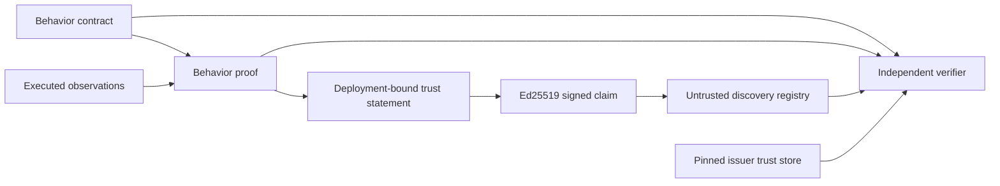

# AIC Verified Trust Layer

AIC Verified turns a passed behavior proof into a portable, cryptographically verifiable claim about a specific origin, deployment, source revision, operation, contract, and proof.

It is designed to remain useful regardless of which protocol invokes the operation. WebMCP, MCP, OpenAPI, a human UI, and future surfaces can all contribute observations to the same behavior contract.

## What ships now

The repository implements `aic.trust/0.1`:

- Ed25519 issuer keys and SHA-256-derived key IDs;
- signed trust statements bound to a passed AIC behavior proof;
- exact origin, environment, deployment ID, and full source-revision claims;
- pinned trust stores with issuer, origin, validity-window, and revocation policy;
- independently verifiable registries with embedded signed attestations;
- `/.well-known/aic-trust` origin discovery;
- CLI generation, validation, inspection, verification, registry build, and query commands;
- a native Chrome/WebMCP evidence runner in `@aicorg/evidence-playwright`; and
- GitHub Actions packaging plus GitHub OIDC/Sigstore artifact provenance on trusted runs.

All formats, schemas, signing code, verification code, browser evidence primitives, and registry tools are open source.

## Artifact chain



The registry is not a trust anchor. A mirror can host the registry, but consumers verify each embedded attestation against a trust store they chose.

## Generate an issuer key

```bash
aic trust keygen \
  --issuer-id example.release \
  --private-key ./.aic/issuer-private.pem \
  --public-key ./.aic/issuer-public.pem \
  --trust-store ./.aic/trust-store.json \
  --origin https://app.example.com
```

The command refuses to overwrite existing key material unless `--force` is supplied. It does not print the private key and attempts to restrict its filesystem permissions.

For production, keep the private key in a hardware-backed or managed CI signing system. The local command is an interoperability and development path, not a recommendation to commit private keys.

## Sign a passed proof

```bash
aic trust attest \
  ./aic-behavior-contract.json \
  ./aic-browser-proof.json \
  --private-key ./.aic/issuer-private.pem \
  --origin https://app.example.com \
  --environment production \
  --deployment-id deploy_2026_08_29_001 \
  --source-revision 0123456789abcdef0123456789abcdef01234567 \
  --source-repository https://github.com/example/app \
  --issuer-id example.release \
  --issuer-kind organization \
  --runner-id release-evidence \
  --runner-kind ci \
  --out-file ./attestations/checkout.json
```

Attestation creation fails if the behavior proof failed or if its contract digest does not match the supplied contract. The signed statement includes the contract ID and digest, stable domain `operation_id`, proof digest, evidence level, origin, deployment, and revision.

## Verify independently

```bash
aic trust verify ./attestations/checkout.json \
  --trust-store ./.aic/trust-store.json \
  --contract ./aic-behavior-contract.json \
  --proof ./aic-browser-proof.json \
  --expect-origin https://app.example.com \
  --expect-revision 0123456789abcdef0123456789abcdef01234567
```

Verification checks:

- strict artifact schemas;
- key ID against the actual public key;
- Ed25519 signature validity;
- key status and validity window;
- issuer identity and allowed origins;
- verifier-supplied origin and revision expectations; and
- optional byte-for-byte canonical contract and proof bindings.

Results distinguish `local_signed_claim`, `ci_signed_claim`, and `remote_signed_claim`. These labels describe the signed runner class; they do not elevate a claim into independent certification. Production policy can additionally pin exact issuer IDs, key IDs, runner IDs, origin, and revision.

## Build and query a registry

```bash
aic registry build ./attestations \
  --trust-store ./.aic/trust-store.json \
  --registry-id example.public \
  --out-file ./registry.json

aic registry verify ./registry.json --trust-store ./.aic/trust-store.json
aic registry query ./registry.json \
  --origin https://app.example.com \
  --operation-id checkout.complete.domain \
  --environment production
```

`registry query` also accepts HTTPS URLs; plain HTTP is allowed only for localhost. A conforming app can publish the registry at:

```text
/.well-known/aic-trust
```

The checked-in root [`registry/index.json`](../registry/index.json) is intentionally empty until real external issuers provide verifiable claims. Empty is more trustworthy than fabricated adoption.

## Native WebMCP evidence

`@aicorg/evidence-playwright` launches a Chromium-family browser and works with the browser's real `document.modelContext` implementation. It can:

- inspect registered native WebMCP tools;
- require native `getTools` and `executeTool` support;
- probe draft input encoding only through a caller-confirmed read-only tool;
- execute a consequential tool exactly once with the detected encoding; and
- record browser version, API shape, feature mode, argument encoding, and application evidence.

The checkout reference currently records Chrome `152.0.7977.65` using `document.modelContext`. That implementation accepted the Chrome-documented JSON-string input, while the date-pinned draft IDL describes object input. AIC records this as `json_string_compat` rather than silently normalizing the difference.

Run the strict browser proof:

```bash
pnpm --dir examples/nextjs-checkout-demo run aic:verify:browser
```

Set `AIC_BROWSER_BASE_URL` and `AIC_BROWSER_MANAGE_SERVER=false` to target an already-running deployment. The reference harness starts a localhost demo only when no server is available.

## Two complementary signature layers

The CI workflow uses two mechanisms:

1. The AIC Ed25519 signature is vendor-neutral and can be checked offline with a pinned trust store.
2. GitHub artifact attestation binds the packaged evidence archive to the GitHub repository, workflow, event, and commit through GitHub OIDC and Sigstore provenance.

The second layer is created only on trusted non-pull-request runs. The CI-generated private AIC key stays in the runner's temporary directory and is never uploaded.

The repository workflow uses a fresh run-scoped AIC key, so its uploaded trust store is an interoperability record, not a pre-pinned long-lived trust anchor. Consumers rely on GitHub's attested bundle provenance for that lane. A production issuer that needs vendor-neutral offline trust should protect a stable signing key and distribute its public trust-store entry through a separately authenticated channel.

## Precise trust boundary

A valid AIC signature proves that the holder of a trusted private key signed the exact statement. It does not independently prove that:

- the claimed origin was reachable;
- the claimed revision was actually deployed there;
- the contract covered every material risk;
- the runner observed every side effect;
- the issuer key was uncompromised; or
- a regulator or independent auditor endorsed the result.

GitHub artifact provenance proves where the CI evidence bundle was built; it still does not prove current production reachability. The open remote runner kit now verifies exact origin/deployment/revision bindings and emits digest-bound receipts, but an independence claim is valid only when a genuinely separate operator controls that run and its key. A production-grade claim should combine a protected issuer key, a trusted or independently operated remote runner, origin/deployment verification, short validity windows, revocation, retained raw evidence, consumer policy, and public provenance or transparency receipts.

See [Protocol Evidence and Remote Observation](./evidence-adapters.md), [Assurance Policy](./assurance-policy.md), and [Transparency and Key Rotation](./transparency-and-key-rotation.md) for the next-layer controls.

See [Threat Model](./threat-model.md) before presenting AIC Verified evidence externally.

## JSON Schemas

- [`trust-statement.schema.json`](../schemas/trust-statement.schema.json)
- [`signed-attestation.schema.json`](../schemas/signed-attestation.schema.json)
- [`trust-store.schema.json`](../schemas/trust-store.schema.json)
- [`trust-registry.schema.json`](../schemas/trust-registry.schema.json)
