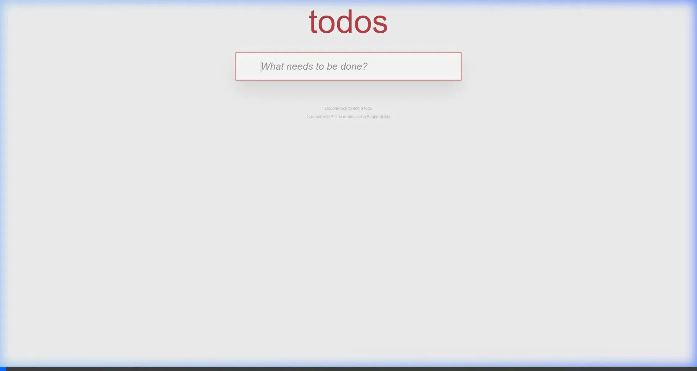

# TodoMVC React: AIC Interaction Demo

This fixture shows explicit AIC semantics on a familiar TodoMVC application. It is useful for discovery and MCP demonstrations without the domain complexity of the checkout or CRM examples.

## Included

- `AICInput` and `AICButton` instrumentation for core todo actions;
- stable IDs and explicit descriptions instead of visible-text contracts;
- Vite middleware for `.well-known` AIC endpoints;
- an MCP discovery simulation; and
- a historical visual browser-agent recording.

This example does not currently contain an `aic.behavior/0.1` contract. It demonstrates interaction discovery, not cross-surface behavioral assurance.

## Run

From the repository root:

```bash
pnpm install
pnpm --dir examples/todomvc-react run dev
```

The app runs at [http://localhost:5173](http://localhost:5173), with discovery at:

- [/.well-known/agent.json](http://localhost:5173/.well-known/agent.json)
- [/.well-known/agent/ui](http://localhost:5173/.well-known/agent/ui)

## Simulate MCP discovery

Keep the dev server running, then execute:

```bash
node ./examples/todomvc-react/simulate-mcp-client.mjs
```

The script uses the same handlers as `@aicorg/mcp-server` and writes `mcp-simulation-result.json` with discovery, UI, actions, and workflows.

## Historical recording

The recording shows a visual agent creating two items, toggling completion, and clearing completed items:



Treat it as a demonstration, not a controlled benchmark or behavior proof.

For a current executed parity example, use [Next.js Checkout](../nextjs-checkout-demo/README.md). For proof semantics, read [Behavior Assurance](../../docs/behavior-assurance.md).
